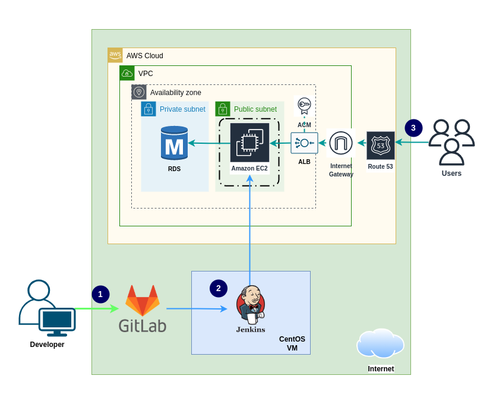

# EC2 RDS Route53 ALB ACM and Jenkins with Java and MySQL

AWS Service setup

- Create VPC, subnets, and route tables
- Create EC2 instance, RDS database
- Create SSL/TLS Certificate
- Create Load balancer and Auto scaling group
- Create Route 53 domain

External service

- Jenkins CI-CD Pipeline
